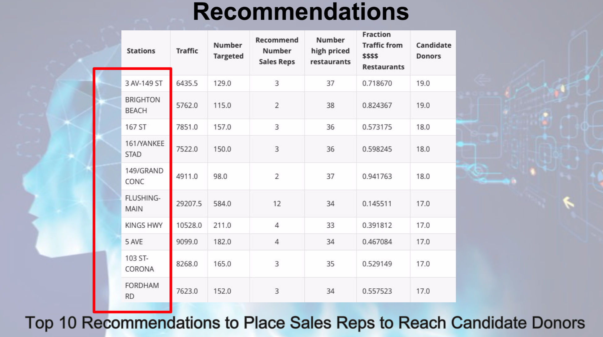

Image Source:clipartxtras.com

### Background

WomenTechWomenYes (WTWY) International is organizing an annual gala at the beginning of Summer 2018. WTWY is interested in harnessing the power of data and analytics to optimize the effectiveness of their street team work, which is a significant portion of their fund-raising efforts. Being a new and inclusive organization, WTWY tries to do double duty with the gala both to fill the event space with individuals passionate about increasing the participation of women in technology, and to concurrently build awareness and reach. 
To do this, they are planning to place street teams at entrances to subway stations to collect email addresses. Those who sign up are sent free tickets to the WTWY gala.
### Challenge

Using the MTA (Metropolitan Transportation Authority of the State of New York) Data pertaining to Subways, help WTWY optimize the placement of street teams to gather most signatures from those who will attend the gala and contribute to the cause.

### Analysis

After considerable data cleaning and data analysis using Pandas, the MTA turnstiles data helped identify the weekdays and related time periods when the subways are the busiest. Using Yelp API, pricey restaurants that remained open during the corresponding times, close to the busiest stations were identified.
The reasoning behind this procedure was to aim to maximize the likelihood of targeting, engaging and encouraging affluent commuters(who are most likely to visit pricy restaurants) to donate to the WTWY Gala. To corroborate our recommendation, we used NYC Crime data to check if these restaurants/subway stations were in low-crime areas, the rationale being that the wealthy generally avoided high-crime areas.

### Results
The stations were identified through Exploratory Data Analysis using Pandas. GeoPandas was used to plot these stations on the NYC Map,

### Using GeoPandas
The goal of GeoPandas is to make working with geospatial data in python easier. Geopandas provides a high-level interface to the matplotlib library for making maps.Geopandas extends the datatypes used by pandasto allow spatial operations on geometric types. Spatial operations on geometric types are performed by shapely.Geopandas further depends on fiona for file access and descartes and matplotlib for plotting.
The most important data structure we have used is the GeoDataFrame. It is a tabular data structure that contains a GeoSeries.A GeoSeries is a vector where each entry in the vector is a set of shapes corresponding to one observation. An entry may consist of only one shape (like a single polygon) or multiple shapes that are meant to be thought of as one observation (like the many polygons that make up the State of Hawaii or a country like Indonesia)
The most important property of a GeoDataFrame is that it always has one GeoSeries Column that holds a special status. This GeoSeries is refered to as the GeoDataFrame's "geometry". When a spatial method is applied to a GeoDataFrame, it's commands will always act on the geometry column.

To plot the map we need to distribute to the street teams at WTWY, we need to use the layering technique.

The base : NYC Map

Data Source:NYC Taxi and Limousine Commission's NYC Taxi Dataset from 2009 to 2016.

Layer I : Top 10 recommended Subway Stations (from MTA Foot Traffic Data)

Data Source:  MTA turnstile data from Summer2016, Summer2017, Summer2018

The data was cleaned using Pandas and a Python dictionary of the top 10 busiest stations on Friday Nights was generated, along with the geolocations.

Layer II: NYC Roberry and Criminal Trespassing Geolocations

This is a cleaned dataset that takes into account only crimes that Subway commuters are more concerned about such as robbery and criminal trespassing, which deter wealthy commuters away from certain locations.

Original Dataset: Include all valid felony, misdemeanor, and violation crimes reported to the New York City Police Department (NYPD) for all complete quarters so far the year (2016). Offenses occurring at intersections are represented at the X Coordinate and Y Coordinate of the intersection

These maps were distributed to the street teams at WTWY International.  

### Conclusion

The best strategy to raise funds for WTWY Annual Gala is to send street teams(volunteers) to the top 10 busiest stations that were identified, between 4pm and 9 pm.

### Recommendation

Our recommendations are summarized in the table below.

